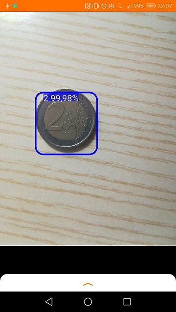

# CoinDetector
Android application for coin detection and classification using Tensorflow lite.
If you want to try this application you can find apk in APK folder.

This application is made on top of Tensorflow's demo apps **[Object detection](https://github.com/tensorflow/examples/blob/master/lite/examples/object_detection/android/README.md)** and **[Image classification](https://github.com/tensorflow/examples/blob/master/lite/examples/image_classification/android/README.md)**.

The app is basically divided into 2 steps:
1. Obgect detection: in order to recognize coins and their bounding boxes.
2. Image classification: takes single coin images and classifies them.

Note: usually this task can be performed by a single neural network model, unfortunatelly due to Tensorflow lite limitation and/or low device power i was forced to devide the workflow in 2 steps.

# Object detection

Tensorflow object detection demo provides a robust camera application and efficient images inference due to multithreading, it needs a small customization to a specific use case. In particular in "TFLiteObjectDetectionAPIModel" class parameters like image dimension, crop dimension, model size etc.. need to be set.

For training an object detection model i used Object detection API as explained in this **[tutorial](https://tensorflow-object-detection-api-tutorial.readthedocs.io/en/latest/training.html)**, a much deeper documentation and a list of pre-trained models (model zoo) can be found **[here](https://github.com/tensorflow/models/tree/master/research/object_detection)**.

As far as i know Tensorflow lite doesn't provide a model accurate enough to recognize and classify in real time small objects with complex features like coins.
After some tests i choosed ssd_mobilenet_v1 because it seems to be the most efficient way to detect whether an object is a coin or not.

# Image classification
Once a coin was detected, using the bounding box I could isolate and make inferences to know which of the 8 classes it belongs to.
The model I chose is MobilenetV2 and I trained it following this **[guide](https://codelabs.developers.google.com/codelabs/recognize-flowers-with-tensorflow-on-android/#0)**.

Click on image below to whatch the video.

